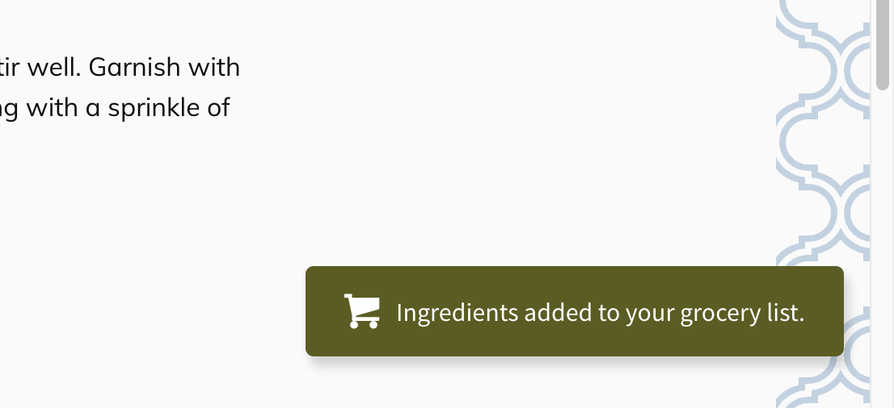

96% of state you need to manage is either data fetched from an API or local data only ~1 component needs.

## data fetched from an API

You can store/handle this data using something like [redux](https://redux.js.org/) + [redux-thunk](https://github.com/reduxjs/redux-thunk) which will give you a lot of flexibility, but I prefer using a library specifically for data fetching to streamline the process. In the GraphQL space, this means something like [Apollo](https://www.apollographql.com/), [URQL](https://formidable.com/open-source/urql/), or [Relay](https://relay.dev/). For REST, [react-query](https://github.com/tannerlinsley/react-query) or [swr](https://github.com/zeit/swr).

## local data only ~1 component needs

If only 1 component needs the data, handle the state directly on the component with `useState` or `useReducer` which is built into React (I occasionally also like to use https://github.com/immerjs/use-immer). Doing so will colocate your state and make it very easy to reason about which component is responsible for which state.

I recommend you start with that approach for _almost_ every component you create then modify it slightly when other components need the state.

1. If a child component needs the state, just pass it as a prop

```jsx
const [open, setOpen] = useState(false)

return (
  <div>
    {/* passing state down to child component */}
    <SomeButton open={open} setOpen={setOpen}>
  </div>
)
```

2. If a sibling or parent component needs the state, [lift up the state](https://reactjs.org/docs/lifting-state-up.html) to the parent

```jsx
// parent component
const [open, setOpen] = useState(false)

return (
  <div>
    {/* passing state down to sibling components */}
    <SomeButton open={open} setOpen={setOpen}>
    <RecipeModal open={open} setOpen={setOpen} />
  </div>
)
```

### Won't I be passing down props a lot (aka prop drilling)?

Most of the time, no. A lot of state is pretty flat and you won't be passing props very deep. If you're passing state down more than 2 levels that's usually an indicator you should do something else. Either you should flatten your component structure or your state doesn't fit into this category and you should follow the next section.

## The Other 6% of State Management

Situations where your state doesn't fit into the above 2 categories should be pretty rare. An example I've run across is alerts.



I wanted to be able to trigger an alert from any component, so the state for whether the alert is visible is roughly global.

For situations like this where it's not feasible to pass down the state through props to each component that needs it, I like using React's built-in [Context](https://reactjs.org/docs/context.html) or a state management library.

What I choose depends on how complex the state is. For simple stuff, I really like [Zustand](https://github.com/react-spring/zustand) and for more complex state [Mobx](https://mobx.js.org/README.html).
